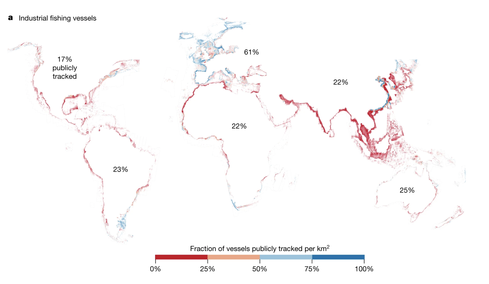

# Pennapps 2025 - by Tejas, Ishaan, Henry, and Marcus

# OverSEAr

Dark vessel scanning for sustainable seas.

# Overview

One-third of fish stocks are operated beyond sustainable levels and an estimated 30–50% of critical marine habitats have been lost due to human industrialization. (Paolo, 2024)

Today, a third of sharks, rays, and chimaeras are at risk of extinction owing to overfishing (Bradley, n.d.), a disaster only made worse by the 72–76% of the world’s non publicly tracked-illegal-industrial fishing vessels.

_Figure 1: 72-76% of industrial fishing vessels are not publicly tracked._

While coast guards make every effort to apprehend these vessels, dedicating 1 of its 11 statutory missions to protecting marine life, the sheer size of the exclusive economic zones they patrol combined with limited resources makes this a difficult job.

<NAME HERE> uses satellite data combined with the automatic identification system (AIS) broadcasting vessels' positions to detect illegal fishing, and with our ML model and AI agent, streamlines the process of stopping unregistered fishing vessels.

# Key Features

# Tech Stack

### Global Fishing Watch
- Satellite Synthetic Aperture Radar (SAR) data from Sentinel-1
- AIS data

### Tensorflow
- Predicts a Priority Score for each region based on the number of registered and unregistered fishing vessels

### Auth0
- Securely controls Clearance Level for each user

### MongoDB
- Stores vessel analysis results-acts as the pipeline between the data and the frontend
- Stores AI agent prompts and responses for context and smooth user experience

### Google Gemini
- Powers AI Agent and creates reports

### Exa
- Researches the local maritime laws of a certain area

# Works Cited

Bradley, S., Cross, A., Maharaj, V., et al. Overfishing. World Wildlife Fund. (n.d.). https://www.worldwildlife.org/threats/overfishing.

Paolo, F.S., Kroodsma, D., Raynor, J. et al. Satellite mapping reveals extensive industrial activity at sea. Nature 625, 85–91 (2024). https://doi.org/10.1038/s41586-023-06825-8
